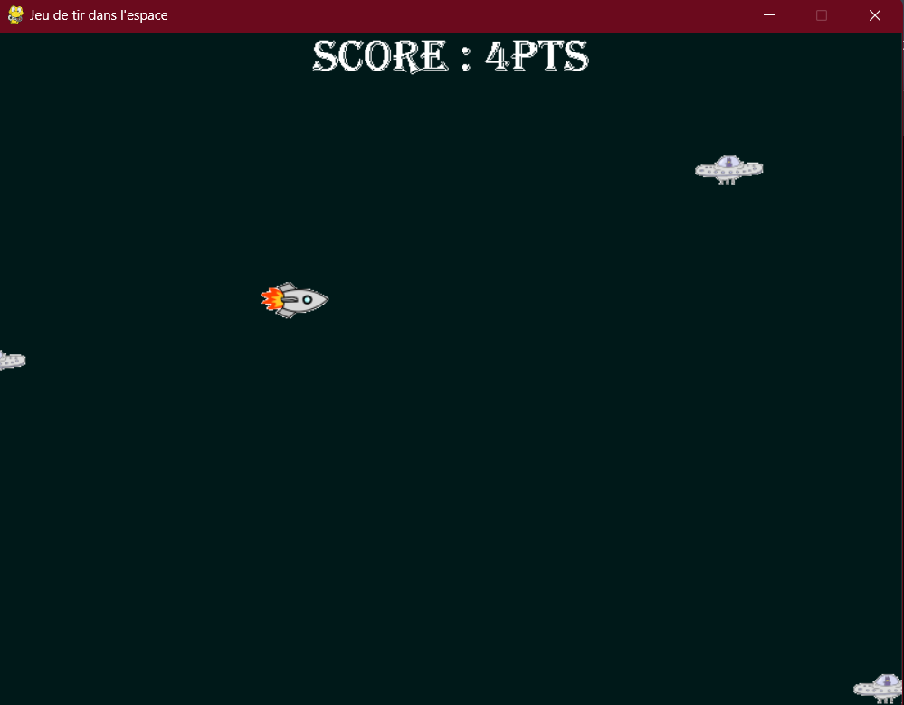

# SPACE INVENDER : IN PYTHON PYGAME

## TABLE OF CONTENTS : 
- [ I - PRESENTATION OF THE GAME ](##-I---PRESENTATION-OF-THE-GAME)
    - [ Game commandes ](##-Game-commandes)
- [ II - HOW TO RUN THE GAME ](##)


## I - PRESENTATION OF THE GAME
Space invender is a popular shooting game in the space. It consists for a vessel which is the hero shoots on aliens which are ennemies. In my implementation of this game, the hero can't shoot more than 3 missiles in same times; when an alien touch the heros the game is over.



## Game commandes
- Move : for move the hero press left, right, top, or bottom key
- Shoot : for shoot a missile press the tab key
- Pause : for pause the game press the space key

## II - HOW TO RUN THE GAME
For run the you must install dependencies. The most important dependecies is python To install pyhon 3.11.2 click [here](https://www.python.org/ftp/python/3.11.2/python-3.11.2-amd64.exe).

To not pollute your computer we recommand that to create a virtual environnement.

_NB : If you want you can skip step concerning virtual env_
``` python
python -m venv myenv
```
This command create a virtual env named myenv.

To activate the env you must type:

- In shell :

```bash
source myenv/scripts/activate
```

- In command prompt/windows cmd

```bash
"myenv/scripts/activate"
```


And now you can install all the libraries specified in the `requirements.txt` file by doing so:

```bash
pip install -r requirements.txt
```
Don't worry we come to the end of the torture 🥲

Now for run the game type just in your shell or pront at the root of the project 

```bash
python jeu.py
```

